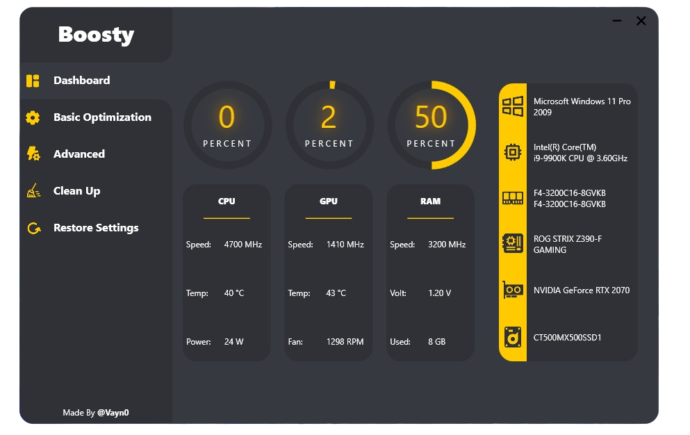

# **Boosty**

# Overview
The Windows Optimization Tool is a simple powerful utility designed to enhance the performance of your Windows operating system. It provides a user-friendly interface that allows you to optimize your system with just one click or customize advanced settings according to your preferences. Whether you're a beginner looking for a quick boost or an advanced user seeking fine-grained control, this tool has got you covered.

# Features
-One-Click Optimization: Boost your system performance with a single click. The tool will automatically apply a set of predefined optimizations to streamline your Windows settings.

-Advanced Customization: If you prefer more control over the optimization process, you can explore the advanced settings. This allows you to selectively enable or disable specific optimizations based on your requirements.

-System Tweaks: The tool offers a collection of system tweaks that can improve various aspects of your Windows experience. From optimizing startup and shutdown times to enhancing network settings, you can fine-tune your system for optimal performance.

-Privacy and Security: In addition to performance enhancements, the Windows Optimization Tool also prioritizes your privacy and security. It provides options to disable telemetry, block unwanted tracking, and enhance system security settings, giving you peace of mind while using your computer.

-Backup and Restore: To ensure safety and flexibility, the tool includes a backup and restore feature. It creates a restore point before applying any optimizations, allowing you to revert to a previous state if needed.

-Lightweight and Intuitive: The tool is designed to be lightweight and user-friendly, making it accessible to users of all skill levels. Its intuitive interface provides clear descriptions and tooltips for each optimization, ensuring you understand the changes being made to your system.
